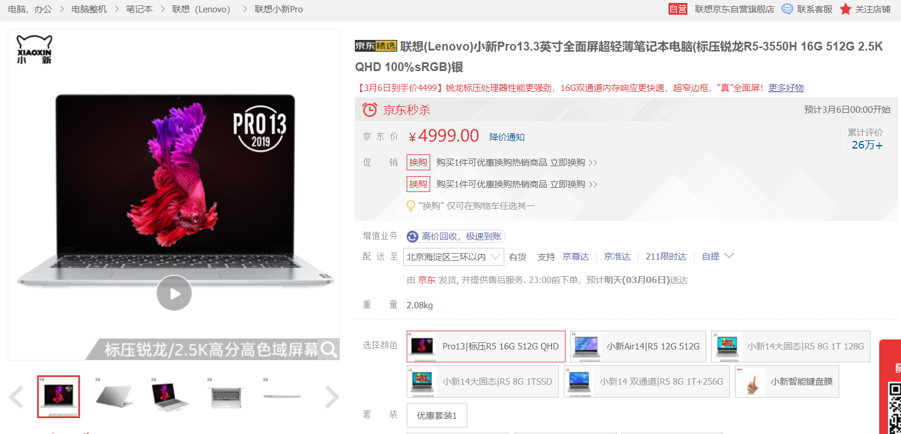
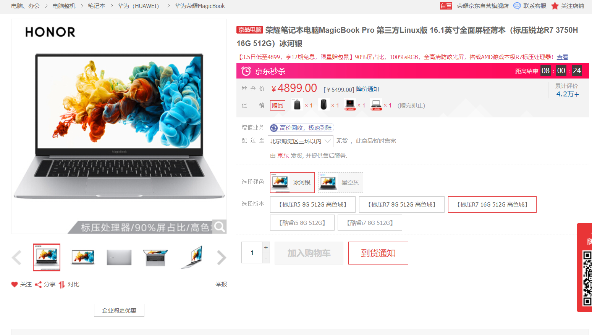
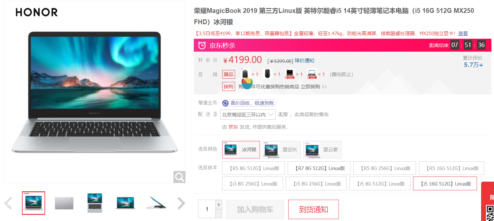

# laptops

1. 第一款：联想(Lenovo)小新Pro13.3英寸
  (京东，3月6日有活动，到手价4499)
  
  
  - 16G的DDR4内存，一般情况绝对够用，我用的就是16G的DDR4
  - 512G的固态硬盘，比机械硬盘好，存取速度快
  - 这款是联想刚出的轻薄本，优点是屏幕，采用了2560x1600分辨率，2.5KQHD 100%sRGB色域
  - 性能上相比荣耀MagicBook要差点，屏幕比荣耀好，适合对屏幕要求高以及便携性要求较高。
  - 机身屏幕13.3英寸，机子很轻巧，容易携带
  
  购买链接: [点击这里](https://item.jd.com/100005171461.html?cu=true&utm_source=kong&utm_medium=tuiguang&utm_campaign=t_1001542270_1001705773_0_1958552361&utm_term=5096c0aa0e0d4de2a71c002419b7f203#none)
   
2. 第二款：荣耀MagicBook Pro 第三方Linux版
  (京东价格： 4899.00 ，华为商城价格：4299)
  
  - 16G的DDR4内存，一般情况绝对够用，我用的就是16G的DDR4
  - 512G的固态硬盘，比机械硬盘好，存取速度快
  - CPU比小新Pro13.3的好10%左右，但是系统预装系统不是我们常用的windows，可能买了之后需要花50元左右重装windows系统。
  - 机身屏幕16.1，1920×1080分辨率，100%sRGB，屏幕算是笔记本里边很大的了，正常是14英寸的，喜欢大屏幕可以选择这个
  - 荣耀MagicBook是华为的子品牌，售后在大城市挺好的
  
  购买链接： [点击这里](https://item.jd.com/100005723679.html?cu=true&utm_source=kong&utm_medium=tuiguang&utm_campaign=t_1001542270_1001705773_0_1958552361&utm_term=e05c1a5afc354d50b396706840b69d2a#crumb-wrap)
 

3. 第三款：荣耀MagicBook 2019 第三方Linux版
  (京东价格，目前4199.00， 华为商城没有机器)
  
  
  - 这一款价格便宜，但是相对应的配置次了些
  - 16G的LPDDR3内存, 比DDR4差一些，但是更省电些
  - 512G的固态硬盘，比机械硬盘好，存取速度快
  - CPU是i5-8265U，比前边低一些，平常使用也够了
  - 14.0英寸，这个屏幕比前两个差了些，1920×1080分辨率，45%NTSC的色域
  - 但是系统预装系统不是我们常用的windows，可能买了之后需要花50元左右重装windows系统。
  
  购买链接： [点击这里](https://item.jd.com/100009482898.html?cu=true&utm_source=kong&utm_medium=tuiguang&utm_campaign=t_1001542270_1001705773_0_1958552361&utm_term=a9d0b7904b424dff9f32412d88cef7e4#crumb-wrap)

